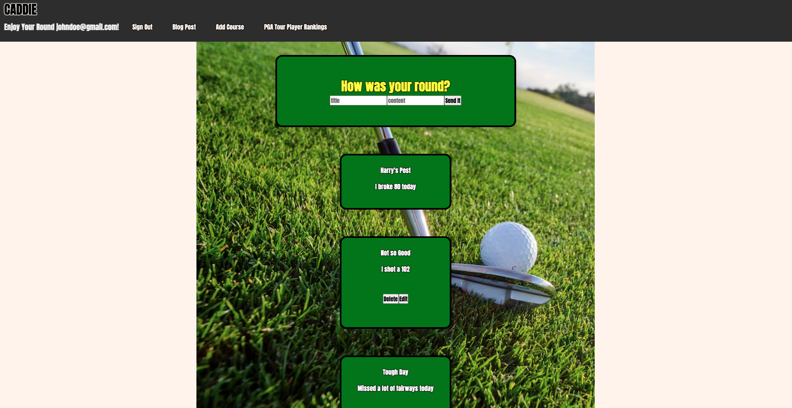
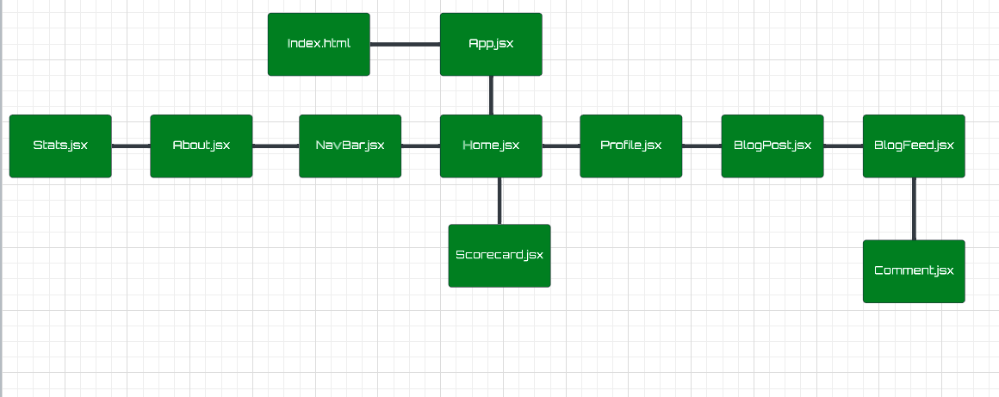
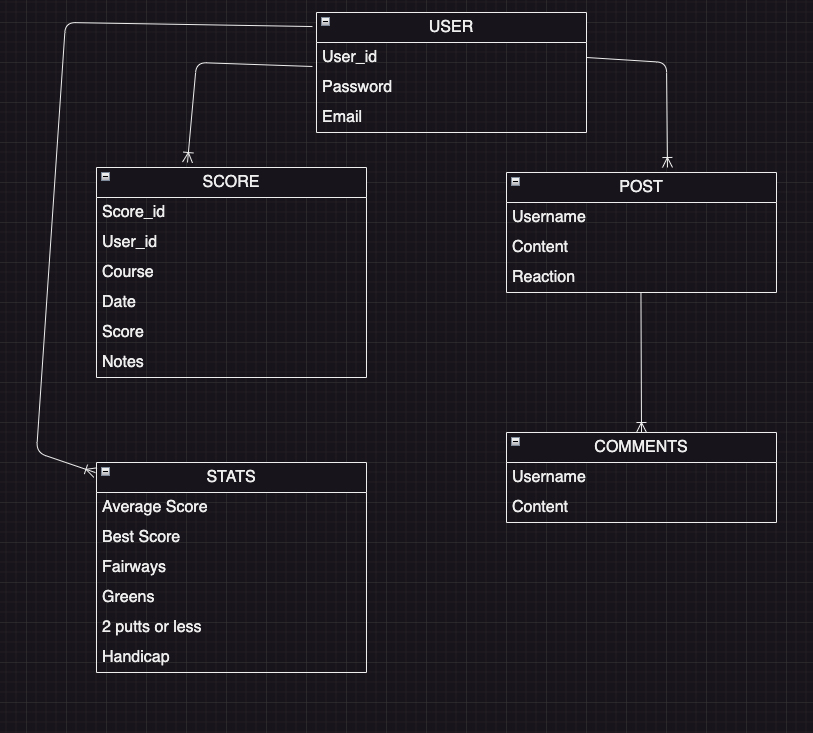

# Caddie

### Date: 07/19/2023

---

## **_Description_**

#### Caddie is a comprehensive web application that allows golfers to create their own course database, monitor live PGA Tour updates such as rankings, events played, etc. In the future Caddie will monitor the user's statistics, and post their round for their friends to see. Keep your golf game on par with Caddie.

 

---

## **_Creator_**

### Patton Grooms

#### [GitHub](https://github.com/pattongrooms) | [LinkedIn](https://www.linkedin.com/in/patton-grooms/)

 

---

## **_Technologies Used_**

#### Mongo, Express, React, Node

 

<!--  -->

##  

## **_API Reference_**

- API Docs [here](https://sportsdata.io/developers/api-documentation/golf)

 

## **_Getting Started_**

- Trello Board [here](https://trello.com/invite/b/xgMVDF6j/ATTIb9631358a8355cef4b8527b7ac8722d771626D7F/caddie-capstone).

 

---

## **_Screenshots_**

### Caddie Wireframe:

Home

  

My Courses

  

 
PGA Rankings

  

 

### Caddie Component Hierarchy Diagram

 
Component Hierarchy Diagram

  

### Caddie ERD:

 
Entity Relationship Diagram

  

 

---

## **_Future Updates_**

- Integration with golf course APIs for course information, yardage, weather, etc.

- Social sharing functionalility

- Leaderboards for friendly competition

- Fully Responsive app version to have a Caddie in your pocket

- Interactive Charts for in depth statistics

 

---

### **_Credits_**

 

#####

#####

#####

#####

---
